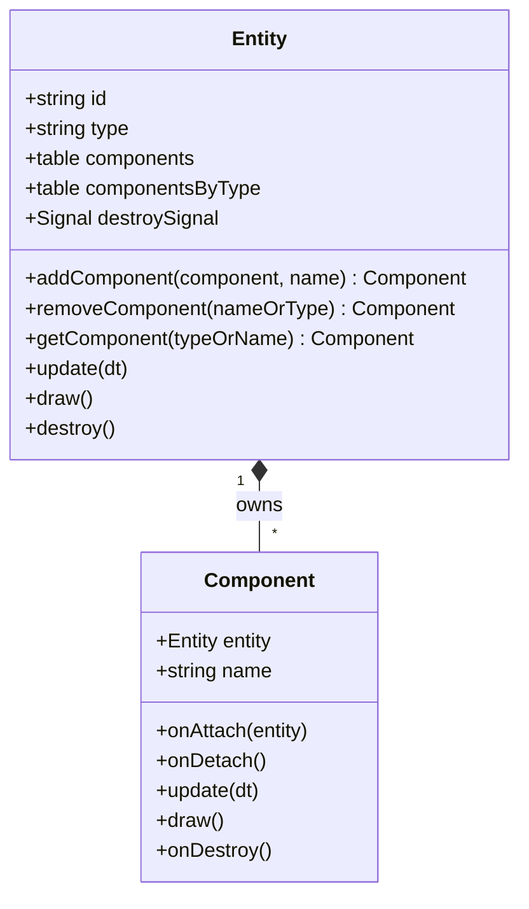
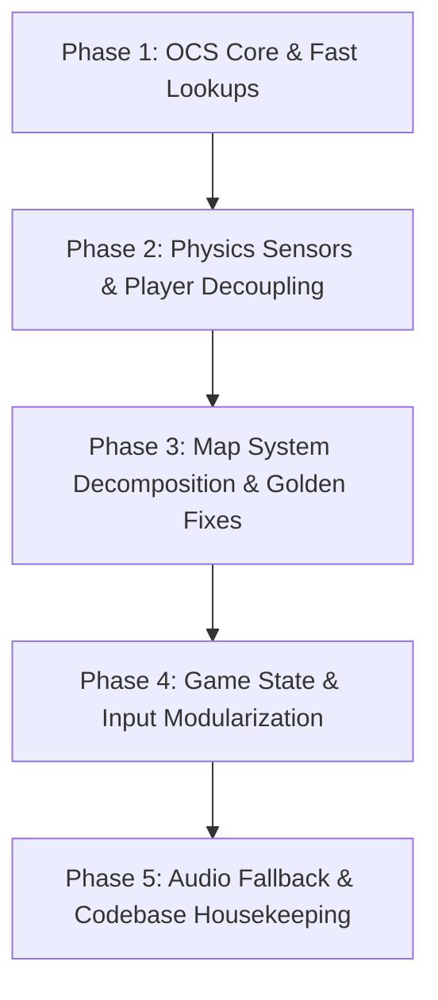

# In-Depth Codebase Refactoring Master Plan: Fido and Kitch

## 1. Executive Summary & Codebase Audit

Following a thorough read of all project source code, markdown documentation (`AGENTS.md`, `ARCHITECTURE.md`, `CONTEXT.md`, `TODO.md`, ADRs 0001–0004), test suites, and IPC tools, this document establishes a **master refactoring plan** for *Fido and Kitch*.

### Current System Health & Code Smells

| Subsystem | File(s) | Key Smells / Architectural Debt |
| :--- | :--- | :--- |
| **Component Entity System** | `src/entity.lua`<br>`src/components/` | • Linear $O(N)$ component lookups (`getComponentByType` loops through array with `utils.instanceOf`).<br>• Inconsistent lifecycle hooks (`update` and `draw` checked via `!= nil`, missing `onAttach`/`onDetach`). |
| **Player Controller & Logic** | `src/player/player.lua`<br>`src/player/player_states.lua` | • Ad-hoc spatial queries with hardcoded pixel math (`bounds.top = bounds.bottom + 4`).<br>• Tight coupling between movement states, physics velocity modifications, and animation triggers.<br>• 375-line `player.lua` acts as a god class combining inventory, death timing, safe position tracking, and sensor queries. |
| **Map Loader & STI Wrapper** | `src/map.lua`<br>`src/map/tmx.lua` | • 460-line monolithic `map.lua` combining STI loading, entity creation, ladder volume generation, collision boundary creation, background parallax, and canvas rendering.<br>• ~60 lines of dead/commented-out legacy code.<br>• 2 integration tests failing in `tests/integration/tmx_golden_test.lua` due to TMX parsing schema mismatches. |
| **Game State FSM** | `src/game_states.lua` | • 463-line file containing all top-level game states (`MenuState`, `InGameState`, `GameOverState`).<br>• Legacy commented `suit` UI code.<br>• Mixed input handling (some states check `love.keypressed`, others delegate to `InputManager`). |
| **Audio & SFX** | `src/components/sound.lua` | • Missing WAV files trigger frequent `Sound file not found` console warnings during headless tests and gameplay.<br>• Direct creation of `love.audio.Source` objects per sound call without central volume/mute control or test suppression. |
| **Input Manager** | `src/input/input_manager.lua` | • Duplicate method declarations (`isForcedNonGamepad` declared twice at lines 175 and 179). |
| **CI / CD Pipelines** | `.github/workflows/` | • Workflows (`build.yml`, `deploy.yml`) reference non-existent `./install.sh` instead of `./setup.sh`. |
| **AI Agent IPC Infrastructure** | `src/ipc/`<br>`.opencode/tools/` | • Missing direct map switching over IPC (`LOAD_MAP`), screenshot capture (`TAKE_SCREENSHOT`), tile collision grid queries (`GET_TILE_GRID`), and dynamic entity spawning (`SPAWN_ENTITY`). |

---

## 2. Component Entity System (OCS) Architectural Evaluation

### The Core Question: *Do we stick with the Component Entity System?*
**Verdict: YES — Preserve and Refine the Object-Component System (OCS).**

#### Why OCS is the Right Choice for Fido & Kitch:
1. **Heterogeneous Puzzle Objects**: The game features diverse interactive elements (`PushBox`, `Boulder`, `PressureSwitch`, `Switch`, `Key`, `Cage`, `Drawbridge`, `JumpPad`, `Teleport`, `Spider`, `Robot`, `StoryEntity`). Inheritance would force rigid trees (e.g. `StaticEntity -> InteractiveEntity -> TriggerEntity`). OCS enables flexible composition:
   ```lua
   -- Example: Pressure Switch composition
   Entity + Collider(sensor) + Sprite + Sound + PressureSwitchComponent
   ```
2. **Simple vs Pure ECS**: Pure data-oriented ECS (separate Component arrays + System queries) introduces unnecessary indirection for a 2D puzzle platformer with ~50 active entities per level. An **Object-Component System (OCS)**—where entities are component containers that manage their own components—strikes the exact balance of **simplicity, modularity, and rapid iteration**.

#### Refined OCS Architecture:



Key improvements:
- **Dual Component Indexing**: Maintain `self.components` array (for predictable `update`/`draw` order) and `self.componentsByType[classKey]` map for $O(1)$ fast lookups.
- **Formal Lifecycle Callbacks**: `onAttach(entity)`, `onDetach()`, `update(dt)`, `draw()`, `onDestroy()`.

---

## 3. Detailed Master Refactoring Plan

The refactor is structured into **5 independent, test-verified phases**.



---

### Phase 1: Core OCS & Component Fast Lookups

#### Goal
Upgrade `Entity` (`src/entity.lua`) to support $O(1)$ component access, clean lifecycle hooks, and zero allocation overhead during queries.

#### Implementation Details

##### 1. Upgrade `src/entity.lua`:
```lua
local Entity = Class{}

function Entity:init()
    self.type = 'entity'
    self.components = {}             -- Array for ordered update/draw iteration
    self.componentsByType = {}       -- Table for O(1) type/name lookups
    self.destroySignal = Signal{}
end

function Entity:addComponent(component, name)
    table.insert(self.components, component)
    component.entity = self

    local key = name or component.class or getmetatable(component)
    if key then
        self.componentsByType[key] = component
    end

    if component.onAttach then
        component:onAttach(self)
    end
    return component
end

function Entity:getComponent(typeOrName)
    local comp = self.componentsByType[typeOrName]
    if comp then return comp end

    -- Fallback linear search for legacy class inheritance queries
    for _, c in ipairs(self.components) do
        if utils.instanceOf(c, typeOrName) then
            return c
        end
    end
    return nil
end
```

##### 2. Verification:
- Run `./test-unit.sh`
- Add new unit tests in `tests/unit/entity_lifecycle_test.lua` verifying `onAttach`, `onDetach`, and $O(1)$ lookup speed.

---

### Phase 2: Physics Sensors & Player Controller Decoupling

#### Goal
Remove hardcoded magic bounding-box math from `Player` (`src/player/player.lua`) and encapsulate spatial queries inside `Collider` and specialized support modules.

#### Architectural Breakdown

```
src/player/
├── player.lua              # Player entity bootstrapping & component registration
├── player_states.lua       # FSM states (WalkIdle, Fall, Ladder, Dead, Wrapped)
├── player_movement.lua     # Pure movement math & horizontal decisions
├── ground_support.lua      # Ground checks & edge support queries
└── player_sensors.lua      # Encapsulated ladder, killzone, and usable queries (NEW)
```

#### Implementation Details

##### 1. Create `src/player/player_sensors.lua`:
```lua
local PlayerSensors = {}

function PlayerSensors.queryKillZone(world, collider)
    local bounds = collider:getBounds()
    bounds.left = bounds.left + 4
    bounds.right = bounds.right - 4
    for _, c in ipairs(world:queryBounds(bounds)) do
        if c.entity and c.entity.isKillZone then
            return c.entity
        end
    end
    return nil
end

function PlayerSensors.queryLadder(world, collider, offset)
    local bounds = collider:getBounds()
    bounds.left = bounds.left + 4
    bounds.right = bounds.right - 4
    bounds.bottom = bounds.bottom - (offset or 4)
    for _, c in ipairs(world:queryBounds(bounds)) do
        if c.entity and c.entity.isLadder then
            return c.entity
        end
    end
    return nil
end

return PlayerSensors
```

##### 2. Clean Up `src/player/player.lua`:
- Replace inline queries (`queryKillZone`, `queryLadder`, `queryLadderBelow`, `queryOnGround`) with calls to `PlayerSensors` and `GroundSupport`.
- Standardize `walkable` and `sensor` properties on all custom colliders (e.g. `Drawbridge`, `PushBox`, `Boulder`).

##### 3. Verification:
- Run `./test-unit.sh` and `./test-integration.sh`.
- Run E2E tests (`./test-e2e.sh`) to verify player landing, ladder mounting, and physics collisions.

---

### Phase 3: Map System Decomposition & Golden TMX Fixes

#### Goal
Refactor `src/map.lua` from a 460-line monolith into single-responsibility modules and fix the 2 failing integration golden tests.

#### Target Directory Structure
```
src/map/
├── init.lua                # Map class & public entrypoint
├── map.lua                 # Core STI wrapper & layer rendering
├── entity_factory.lua      # Tiled object layer -> Runtime entity instantiation
├── collision_builder.lua   # Collision boundaries & ladder sensor volumes
├── parallax_renderer.lua   # Parallax background rendering (renamed from map_parallax)
└── tmx.lua                 # Direct TMX XML parser & template resolver
```

#### Implementation Details

##### 1. Separate Map Subsystems:
- **`entity_factory.lua`**: Encapsulate object layer iterating, property mapping, and dynamic `require('src.entities.<type>')`.
- **`collision_builder.lua`**: Extract static physics bodies (`createStaticPhysicsBodies`), ladder volume colliders, and level boundary generation (`createStaticPhysicsBodyBoundary`).
- **Clean up dead code**: Remove commented inheritance blocks (lines 90–112, 130–137, 227–234).

##### 2. Resolve TMX Golden Test Failures:
- **Failure 1**: `sandbox.tmx` golden export mismatch (`.layers.4.objects.2: expected table, got nil`). Investigate `src/map/tmx.lua` object group layer index and property merging.
- **Failure 2**: `night_forest.tmx` offset/dimension mismatch (`.height: expected 20, got 1080`). Ensure image layer dimensions match STI's expected map dimensions vs screen canvas bounds.

##### 3. Verification:
- Run `./test-integration.sh` — ensure all 73 integration tests pass (0 failures).

---

### Phase 4: Game State & Input Manager Modularization

#### Goal
Split `src/game_states.lua` into individual state files and clean up `InputManager`.

#### Target Directory Structure
```
src/states/
├── menu_state.lua          # Map list navigation & main menu UI
├── ingame_state.lua        # Level runtime, lives HUD, death handling & camera easing
└── game_over_state.lua     # Game over screen & restart options
```

#### Implementation Details

##### 1. Modularize States:
- Create `src/states/menu_state.lua`, `src/states/ingame_state.lua`, and `src/states/game_over_state.lua`.
- Remove dead `suit` UI commented code from `MenuState`.
- Update `src/game.lua` to require states from `src/states/`.

##### 2. Clean Up `src/input/input_manager.lua`:
- Remove duplicate `isForcedNonGamepad` method definitions (lines 175–185).
- Ensure input handling across `MenuState`, `InGameState`, and `GameOverState` uniformly uses `InputManager:wasPressed(playerIdx, action)`.

##### 3. Verification:
- Run `./test-unit.sh` and `./test-integration.sh`.

---

### Phase 5: Audio Fallback & Codebase Housekeeping

#### Goal
Provide audio fallback for headless test runs, silence missing asset warnings, and purge dead legacy files.

#### Implementation Details

##### 1. Update `src/components/sound.lua`:
```lua
local Sound = Class{}

-- Global audio suppression flag for headless test environments
Sound.silentMode = not (love and love.audio)

function Sound:play(name)
    if Sound.silentMode then return end
    local path = self.sounds[name]
    if not path then return end
    
    local ok, source = pcall(love.audio.newSource, path, 'static')
    if ok then
        source:setPitch(1 + (math.random() * 2 - 1) * self.pitchVariation)
        source:play()
    end
end
```

##### 2. Remove Legacy Files & Fix CI Workflows:
- Remove unused `src/lovedebug.lua`.
- Fix `.github/workflows/build.yml` and `.github/workflows/deploy.yml` line calling `./install.sh` to `./setup.sh`.
- Clean up obsolete imports in `conf.lua` and `src/main.lua`.

##### 3. Verification:
- Run `./test-all.sh` to confirm green status across Unit, Integration, and E2E tiers.

---

## 4. Additional High-Value Infrastructure & Gameplay Enhancements

Beyond structural refactoring, the following system-level additions will improve developer experience, performance, and co-op gameplay:

### 4.1 Texture & Asset Caching (`src/utils/asset_manager.lua`)
- **Problem**: Entities load PNG images directly via `love.graphics.newImage` inside their `init` constructor. Spawning 20 coins or multiple push blocks results in duplicate disk reads and GPU texture allocations.
- **Solution**: Implement a simple `AssetManager` texture cache:
  ```lua
  local AssetManager = { textures = {} }
  function AssetManager.getImage(path)
      if not AssetManager.textures[path] then
          AssetManager.textures[path] = love.graphics.newImage(path)
      end
      return AssetManager.textures[path]
  end
  ```

### 4.2 Decoupled Global Event Bus (`src/utils/event_bus.lua`)
- **Problem**: Level events (player death, key collection, cage unlocking, level completion) rely on direct entity-to-state callback connections (`entity.deathSignal:connect(...)`).
- **Solution**: Create a global `EventBus` singleton wrapping `Signal` for game-wide notifications:
  ```lua
  EventBus:emit('player_died', player, deathType)
  EventBus:emit('item_collected', player, item)
  EventBus:emit('objective_unlocked', cage)
  ```

### 4.3 Unified Debug Visualizer Pass (`src/ui/debug_overlay.lua`)
- **Problem**: Physics debugging is split across `world:draw()`, entity `draw()` checks, and custom `drawSafePositionMarker()` calls.
- **Solution**: Build a centralized debug overlay system that, when `conf.drawphysics` is active, cleanly renders hitboxes, ladder sensors, path waypoints, safe positions, and camera framing bounds in a single pass.

### 4.4 Persistent Input Mapping & Save System (`src/input/input_config.lua`)
- **Problem**: Controls are currently fixed per player index without persistent rebinding options.
- **Solution**: Extend `InputManager` to read/write custom key bindings to `love.filesystem` JSON/Lua configuration files.

---

## 5. AI Agent & IPC Developer Experience (DX) Infrastructure

To empower AI coding agents (and automated test harnesses) pair programming on *Fido and Kitch*, the following IPC and tooling extensions should be added:

### 5.1 New IPC Commands (`src/ipc/command_handlers.lua` & `game_api.lua`)
1. **`TAKE_SCREENSHOT [filename]`**: Captures the current LÖVE frame to disk and returns the relative image path `OK: Screenshot saved to tests/screenshots/<filename>.png`. Allows multimodal AI agents to visually inspect level layout, collision states, and UI bugs.
2. **`LOAD_MAP <map_name>`**: Switches map dynamically without restarting the executable or navigating `MenuState`.
3. **`GET_TILE_GRID`**: Returns a 2D JSON matrix of map tile types (`0` = empty, `1` = solid terrain, `2` = ladder, `3` = killzone). Allows AI agents to execute automated pathfinding and solvability checks.
4. **`SPAWN_ENTITY <type> <x> <y> [props_json]`**: Spawns an entity into the live game world for rapid sandbox debugging of entity interactions.
5. **`STEP_FRAMES <count>`**: Advances the physics/game loop by $N$ fixed timesteps (1/60s each) synchronously over IPC.

### 5.2 Updated OpenCode Tool Definitions (`.opencode/tools/fido-kitch-ipc.ts`)
Expose the new IPC commands to OpenCode subagents:
- `take_screenshot`: Captures game screen artifact.
- `load_map`: Loads specific map.
- `get_tile_grid`: Fetches tile matrix.
- `spawn_entity`: Spawns debug entity.
- `step_frames`: Advances fixed simulation frames.

---

## 6. Phase Execution Summary & Test Matrix

| Phase | Main Target Files | Key Verification Command | Expected Outcome |
| :--- | :--- | :--- | :--- |
| **Phase 1** | `src/entity.lua`, `src/components/` | `./test-unit.sh` | All unit tests pass; $O(1)$ component lookups active. |
| **Phase 2** | `src/player/`, `src/physics/` | `./test-unit.sh` && `./test-integration.sh` | Clean player physics; no hardcoded bounding math. |
| **Phase 3** | `src/map.lua`, `src/map/`, `src/map/tmx.lua` | `./test-integration.sh` | 100% passing integration tests (0 golden failures). |
| **Phase 4** | `src/game_states.lua` -> `src/states/` | `./test-integration.sh` && `./test-e2e.sh` | Clean state separation; state machine functions cleanly. |
| **Phase 5** | `src/components/sound.lua`, `.github/workflows/` | `./test-all.sh` | Zero warning spam; CI workflow fixed; all 3 test tiers report green. |
| **Enhancements** | `src/utils/asset_manager.lua`, `src/ui/debug_overlay.lua` | `./test-all.sh` | Improved asset efficiency, clean debug visualization, decoupled events. |
| **Agent DX** | `src/ipc/`, `.opencode/tools/` | `love . ipc map=sandbox` | AI agents can take screenshots, step frames, load maps, and query tile grids. |

---

## 7. Invariants & Rules to Maintain

1. **Globals Are Intentional**: Retain global bootstrapping in `src/main.lua` (`conf`, `utils`, `Vector`, `Class`, `World`, `Entity`, `Map`, `Player`, `Game`, `Slab`, `AutoCamera`) as dictated by project rules.
2. **Flat Entity Structure**: New entities stay in `src/entities/<type>.lua`. Only create entity subdirectories (`src/entities/<type>/`) if an entity exceeds multiple source files (per ADR 0003).
3. **Deterministic Physics**: Preserved tile-snap and pushable physics semantics (ADR 0001).
4. **Trusted Map Code**: `object:exec` snippets in Tiled maps are trusted map logic.
